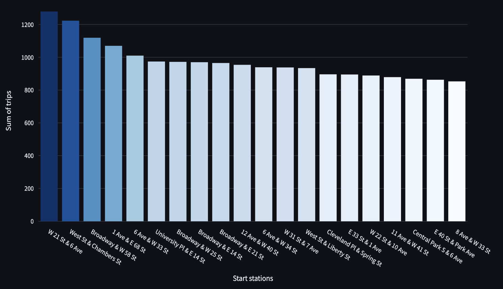
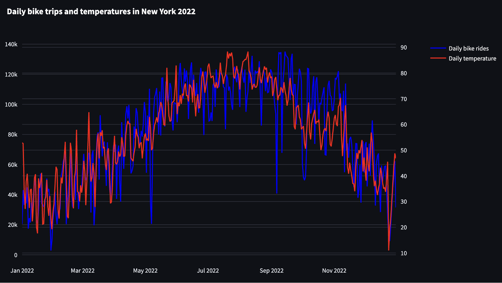
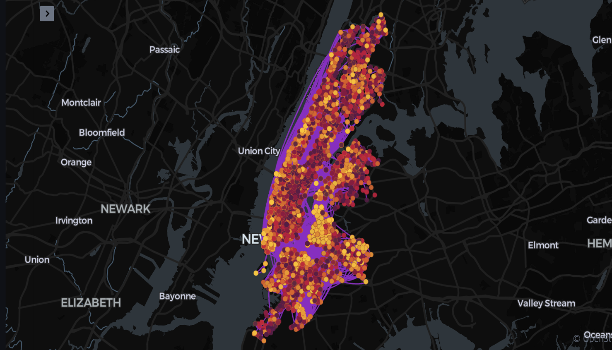

# Citi Bike Strategy Dashboard – Case Study

## Project Overview

Citi Bike users often face bike shortages during certain times and locations. This case study explores key data-driven insights to address availability gaps and guide expansion efforts.

**Role:** Data Analyst  
**Tools Used:** Python, Pandas, NumPy, Matplotlib, Seaborn, Plotly, Kepler.gl, Streamlit  
**Data Sources:** Citi Bike API, NOAA Weather API (New York, 2022)  

➡️ [Launch Interactive Dashboard](https://citibike-fmhbftchuaccupm3umqrwa.streamlit.app/){:target="_blank"}

---

## Objectives

- Identify high-demand stations and usage trends
- Understand weather’s impact on ridership
- Locate underused and underserved areas
- Recommend redistribution strategies and expansion zones

---

## Visualizations

### 1. Most Popular Stations
Bar chart showing the top 20 most-used Citi Bike stations in NYC, highlighting hotspots near major avenues, parks, and transit hubs.

Figure 1: Top 20 most popular Citi Bike stations in NYC.

---

### 2. Monthly Trends + Weather Correlation
Dual-axis chart comparing trip volume with daily average temperature to understand how weather impacts ridership.

Figure 2: Seasonal bike usage trends vs. average temperature.

---

### 3. Trip Density & Station Distribution
Kepler.gl map showing ride density and station placement across NYC, revealing underserved and high-demand areas.

Figure 3: Heatmap of bike trip density across New York City.

---

## Challenges & Solutions

| Challenge | Solution |
|----------|----------|
| Extra records from 2021/2023 | Filtered by date in Python to isolate 2022 data |
| Temperature conversion errors | Corrected Celsius-to-Fahrenheit formula |
| Incorrect geospatial plotting | Verified and corrected latitude/longitude mapping |
| Large dashboard file size | Filtered out low-frequency trips (under 65) to reduce size |

---

## Conclusions & Recommendations

- **Seasonal Optimization:** Reduce bike inventory 20–30% in winter; use weather data for demand forecasting.
- **Redistribution:** Balance bike supply in high-traffic areas using predictive models.
- **Expansion Opportunities:** Add capacity near parks, waterfronts, and underserved areas in Northern Manhattan and outer boroughs.

---
